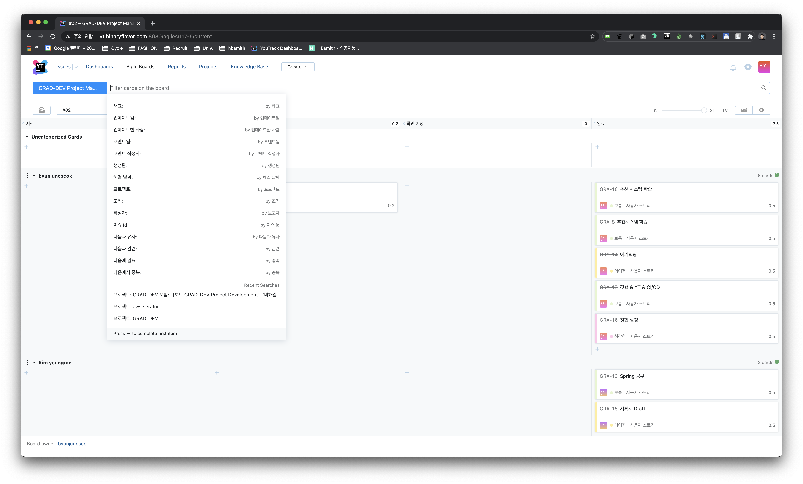
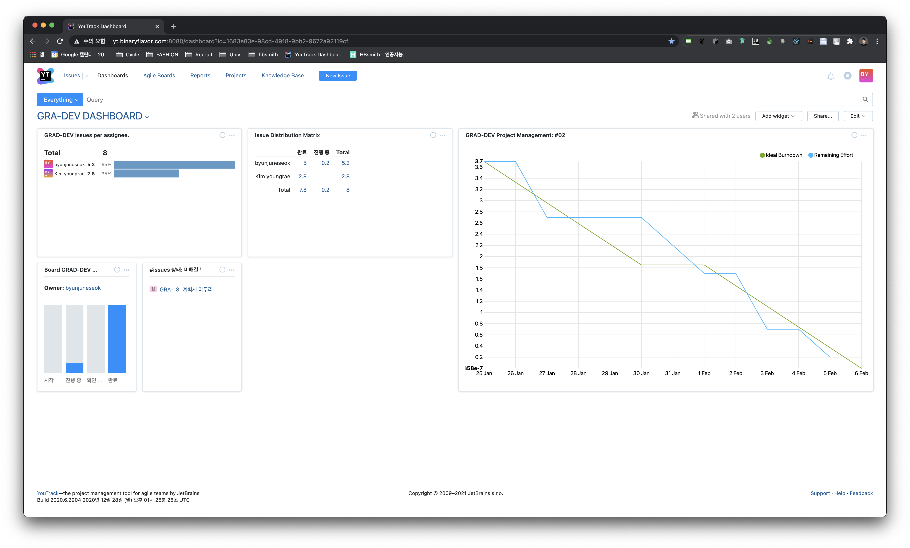

# Documentation

## Introduction
### Motivation
- There's no personalized food choice service that fully automated in the market.

### Two Different goals
- Build the AI model could replace humans insight. (Restaurant recommendation model.)
- Build well architected robust web application.


## Prerequisite for this repository.
### Docs
1. Install [Graphviz](https://www.graphviz.org/download/)
2. Install Requirements.

```bash
pip install -r requirements.txt
```

3. Just run `python3 architecture/main.py`

## Architecture


### IaC with golang
> Infrastructure as Code (IaC) brings automation to the provisioning process, which was traditionally done manually. Rather than relying on manually performed steps, both administrators and developers can instantiate infrastructure using configuration files. IaC helps avoid configuration drift through automation, and increases the speed and agility of infrastructure deployments. It also helps reduce errors and enhances the ability to apply changes through different stages consistently.
> 
> [*Field Notes: Using Infrastructure as Code to Manage Your AWS Networking Environment.*](https://aws.amazon.com/ko/blogs/architecture/field-notes-using-infrastructure-as-code-to-manage-your-aws-networking-environment/)


*Diagram is generated by python code with [diagrams](https://diagrams.mingrammer.com/)*


## Agile works.
### Youtrack



Jetbrains Youtrack is an issue-tracking tool that's mainly used by software developers to track, organize, and prioritize bugs, new features, and improvements for certain software releases. We host a youtrack instance on AWS EC2 and we've been using this since we built a team.

### Github organization

Our final goal is to launch product. We made a [github organization profile](https://github.com/AgileGradDev). 

#### Naming convention for the repositories.

```
<service>-<role>-<platform>
```

##### service

| service | description | acronym |
| --- | --- | --- |
| main web service | 메인 웹 서비스 | main |
| recommendation system | 추천 시스템 | recsys |
| Infrastructure | 인프라스트럭쳐 | infra |
| documentation | 문서 | docs |
| … |  |  |


##### role

| role | description | acronym |
| --- | --- | --- |
| utils | 도구들 | utils |
| backend server | 백엔드 서버 | backend |
| web frontend | 웹 프론트엔드 | frontend |
| database | 데이터베이스 | database |
| IaC | Infrastructure as Code | iac |
| … |  |  |


##### platform

| platform | description | acronym |
| --- | --- | --- |
| springboot | 스프링부트 | springboot |
| python3.x | 파이썬 3.x | py |
| Golang | Go 언어 | go |
| vue.js | vue.js | vue |
| terraform | 테라폼 | terraform |
| tensorflow | 텐서플로우 | tf |
| … |  |  |


## Contacts

[**Juneseok Byun**](https://github.com/byunjuneseok)
- byunjuneseok@gmail.com / byun@hbsmith.io
- [linkedin](https://www.linkedin.com/in/byunjuneseok/)

[**Youngrae Kim**](http://github.com/youngraekimm)
- nahappy15@naver.com
