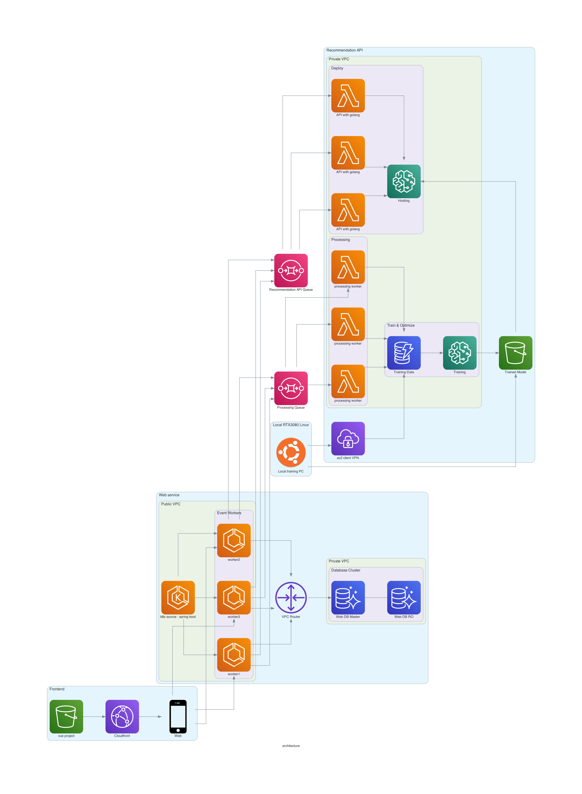

# Main web service

## Backend

- Spring boot.
- Amazon EKS : https://aws.amazon.com/ko/quickstart/architecture/amazon-eks/

## Database

- Amazon Aurora (PostgreSQL) : https://aws.amazon.com/ko/rds/aurora/pricing/

## Network

- AWS Client VPN : https://aws.amazon.com/ko/blogs/korea/new-aws-vpn-client/

## Frontend

- Amazon S3
- Amazon CloudFront

## Others.
- Amazon SQS, SES, SQS, lambda

# Recommendation API service
- every computing resources should 

## Backend 

- Python 

## Database

- DynamoDB
    - https://medium.com/@HubbaDev/building-a-recommendation-engine-with-aws-data-pipeline-elastic-mapreduce-and-spark-ad886b0a1434
    - http://aws-de-media.s3.amazonaws.com/images/AWS_Summit_2018/June6/Doppler/Build%20Your%20Recommendation%20Engines%20on%20AWS%20Today.pdf

    

# Infrastructure as Code

